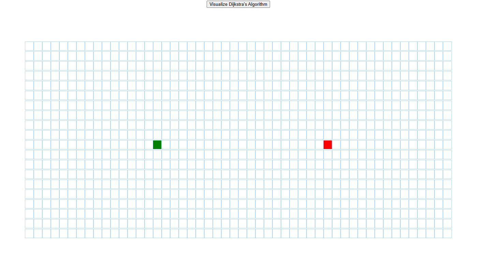
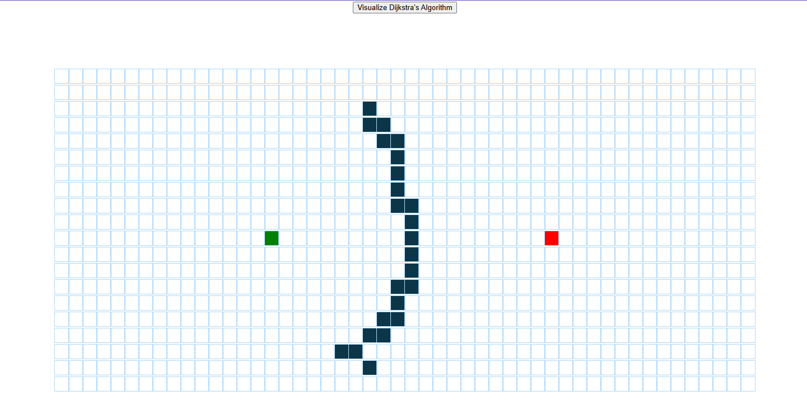
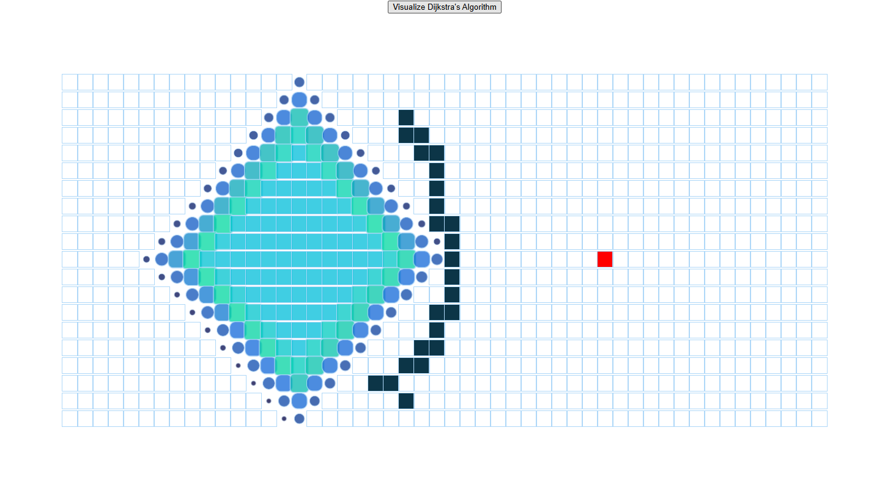
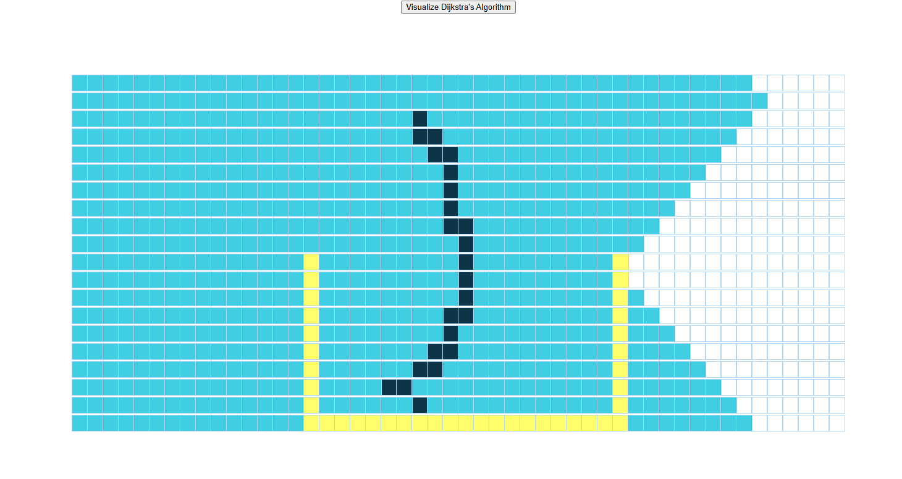

# 🛤️ Dijkstra Visualization using React

This project is a visual representation of **Dijkstra's Algorithm**, implemented using **React.js**. It allows users to understand how the algorithm traverses nodes to find the shortest path in a grid.

🔗 **Live Demo**: [dijkstra-visualization-spon.vercel.app](https://dijkstra-visualization-spon.vercel.app/)

---

## 📸 Screenshots

|  |  |
|  |  |

---

## 📁 Project Structure

```
project-root/
├── src/
│   ├── algorithms/
│   │   └── dijkstra.js
│   ├── PathfindingVisualizer/
│   │   ├── PathfindingVisualizer.css
│   │   ├── PathfindingVisualizer.jsx
│   │   └── Node/
│   │       ├── Node.css
│   │       └── Node.jsx
│   ├── App.css
│   ├── App.js
│   ├── App.test.js
│   ├── index.css
│   └── index.js
```

---

## 🚀 Features

- Interactive grid for visualizing pathfinding
- Walls and weighted nodes simulation
- Animated traversal of nodes using Dijkstra’s algorithm
- Reset and clear board functionality

---

## 📦 Getting Started

### Prerequisites

- Node.js (v16 or higher)
- npm or yarn

### Installation

```bash
git clone https://github.com/your-username/dijkstra-visualizer.git
cd dijkstra-visualizer
npm install
```

### Run the App

```bash
npm start
```

This will start the development server and open the app in your browser.

---

## 📂 Key Files

- `dijkstra.js` – Core logic of Dijkstra’s algorithm.
- `PathfindingVisualizer.jsx` – Main component to render and control the grid.
- `Node.jsx` – Represents each cell/node in the grid.

---

## 🧪 Testing

To run the basic test suite (if defined):

```bash
npm test
```

---

## ✨ Future Improvements

- Add support for other algorithms like A*, BFS, DFS
- Mobile responsiveness
- Color customization for node states

---

## 📄 License

This project is open-source and free to use.

---

Made with ❤️ using React.
